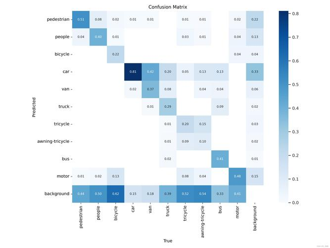

# ch1 深度学习基础

深度学习目标检测是计算机视觉领域的一个重要研究方向，其评估指标对于衡量模型性能至关重要。以下是对深度学习目标检测评估指标的详细介绍：

## 算法分类能力评价指标

### 准确率（Accuracy)

```tex
定义：预测正确的样本数占总样本数的比例。
公式：准确率 = 正确预测的正反例数 / 总数。
accuracy = (TP+TN)/(TP+FP+TN+FN)
应用：评估模型的全局准确程度，但可能受到类别不平衡的影响。
因为若负样本的数量>>正样本数量，虽然正确率仍可以很高，但完全错分类正样本仍能达到较高的Acc
```

### 混淆矩阵（Confusion Matrix）

```tex
定义：用于描述分类模型性能的矩阵，横轴是模型预测的类别数量统计，纵轴是数据真实标签的数量统计。
应用：通过混淆矩阵可以直观地看到模型在各个类别上的表现，包括真正例（TP）、假正例（FP）、真反例（TN）和假反例（FN）的数量。
```



```tex
混淆矩阵怎么解读？
可以从底部的一行开始看，表示的是真实的类别，然后竖行(纵轴)表示的是预测成各个类别的比例。
其中background表示背景，反例
```

```tex
哪些因素能决定TP FP TN FN?
1 iou_threshold 
假如iou=0.5 真实是 positive
if iou_threshold = 0.6 then FN 
if iou_threshold = 0.4 then TP
假如iou=0.5 真实是 negative
if iou_threshold = 0.6 then TN
if iou_threshold = 0.4 then FP
2 class_id 类别预测错了就会被判为negative
```

### 精确率（Precision）

```tex
又称为 查准率 
定义：在所有被检测为正例的样本中，实际为正例的比例。
公式：Precision = TP / (TP + FP)   正检/(正检+误检)
应用：衡量模型对正例的识别精度。
```

### 召回率（Recall）

```tex
又称为 查全率 
定义：在所有应该被检测为正例的样本中，实际被检测为正例的比例。
公式：Recall = TP / (TP + FN)。  正检/(正检+漏检)
应用：衡量模型对正例的识别全面程度。
```

### GT

```tex
在深度学习领域，ground truth（中文意思是“地面真实值”或“基准真实值”）是指用于训练和评估模型的准确标签或数据。它是机器学习算法的参考标准，用于衡量模型的性能和判断模型的准确性。

ground truth的作用
模型训练：深度学习模型通过将自己的预测与ground truth对比来进行学习，从而掌握如何从输入数据中得出正确的输出。模型通过最小化预测结果与ground truth之间的差异，不断提升其预测能力。
模型性能评估：通过比较预测结果与ground truth，可以计算出模型的误差，从而评估模型的性能。常用的评估指标包括准确率、召回率、精度等。
算法性能对比：当需要比较不同算法或模型的效果时，可以使用相同的ground truth作为基准。这样，就能客观地评估各个算法或模型之间的优劣。
ground truth的获取
在深度学习任务中，通常需要训练一个模型来预测输入数据的某些属性或标签。这些标签通常由人类专家手动标注，以提供准确的参考值。这些参考值就是所谓的ground truth。获取ground truth可能是一个耗时且耗力的过程，因为它需要手动检查和注释数据集中的每个案例。在某些情况下，可以使用自动化方法建立真实标签，但这些程序可能不太可靠，并且需要更多的手动评估和纠正。

ground truth的示例
在图像分类任务中，ground truth是图像的正确类别标签。例如，如果正在开发一个ML模型来对动物图像进行分类，则ground truth将是每个图像的正确标签，如“猫”、“狗”或“鸟”。
在3D人脸重建任务中，ground truth可能是准确的三维面部模型。
综上所述，ground truth在深度学习中扮演着至关重要的角色，它为模型的训练和评估提供了准确的参考值，是机器学习算法不可或缺的一部分。
```

### AP (平均精度 Average Precision）

```tex
定义：针对单个类别，计算其精确度-召回率（PR）曲线下的面积。
应用：评估模型在单个类别上的性能表现。
```

1. **平均精度均值（mAP）**

   - 定义：所有类别AP的平均值。
   - 公式：mAP = ΣAPi / N，其中APi为第i个类别的AP值，N为类别数。
   - 应用：评估模型在整个数据集上的综合性能表现，是目标检测中一个最为重要的指标。

### 二、目标定位精度评价指标

1. **交并比（IoU）**
   - 定义：实际识别框与目标标注框的重合程度，即两者交集面积与并集面积的比值。
   - 公式：IoU = 交集面积 / 并集面积。
   - 应用：衡量模型对目标位置的定位精度，通常作为判断检测框是否正确的依据（如IoU>0.5则认为检测正确）。

### 三、其他评价指标

1. **ROC曲线与AUC**
   - ROC曲线：以假阳性率（FPR）为横轴，真阳性率（TPR）为纵轴绘制的曲线。
   - AUC：ROC曲线下的面积，用于评估分类器的性能。
2. **F1-Score**
   - 定义：精确率和召回率的调和平均数，用于综合衡量模型的性能。
   - 公式：F1-Score = 2 * (Precision * Recall) / (Precision + Recall)。
3. **FPS**
   - 定义：每秒处理的图片数量或者处理每张图片所需的时间（需在同一硬件条件下进行比较）。
   - 应用：评估模型的检测速度。

综上所述，深度学习目标检测的评估指标涵盖了算法分类能力、目标定位精度以及其他相关方面。这些指标共同构成了评估模型性能的完整体系，有助于对模型进行全面、客观的评价。